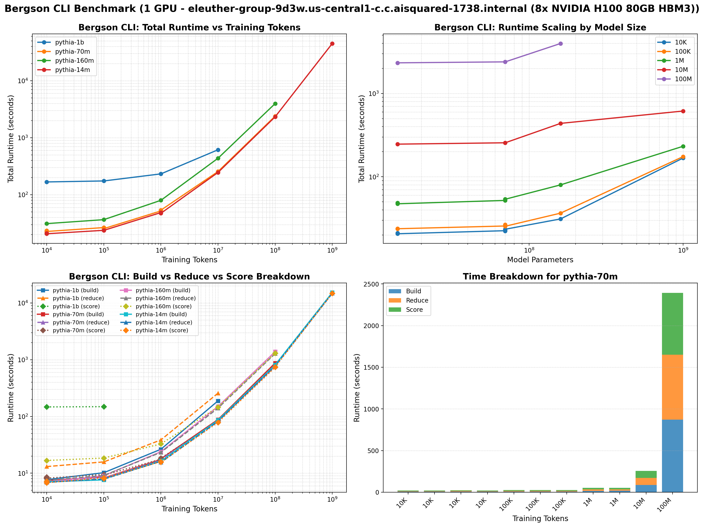
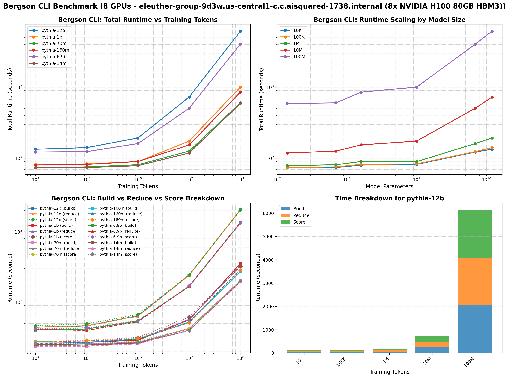

Benchmarks
==========

This section provides indicative performance numbers for the Bergson benchmark suite. Performance will vary based on your hardware configuration and choice of hyperparameters.

Single GPU Configuration
~~~~~~~~~~~~~~~~~~~~~~~~~

8 GPU Configuration
~~~~~~~~~~~~~~~~~~~

Running Your Own Benchmarks
----------------------------

To generate benchmarks for your specific setup, you can use the CLI commands documented in :doc:`../cli`.
