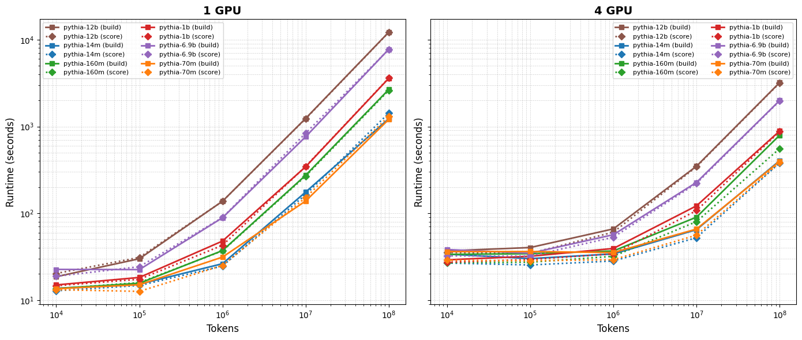
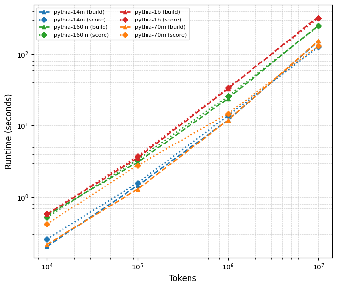
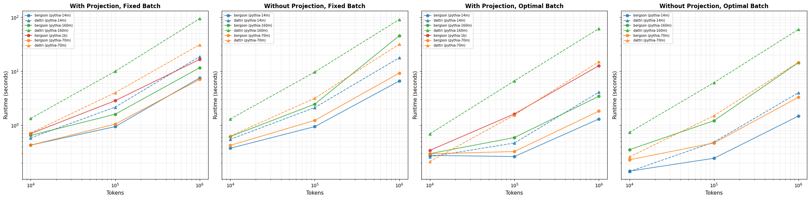
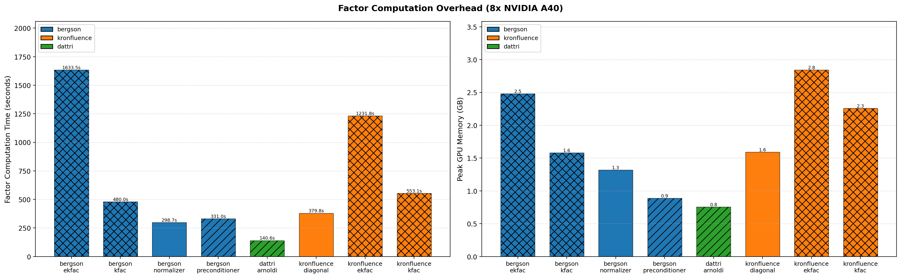

Benchmarks
==========

This section provides indicative performance numbers for the Bergson benchmark suite. Performance will vary based on your hardware configuration and choice of hyperparameters. Indicative performance for dattri provided where possible.

CLI Benchmark
~~~~~~~~~~~~~

Programmatic Benchmark
~~~~~~~~~~~~~~~~~~~~~~

Projection Comparison
~~~~~~~~~~~~~~~~~~~~~

Factor Computation Overhead
~~~~~~~~~~~~~~~~~~~~~~~~~~~

Running Your Own Benchmarks
----------------------------

To generate benchmarks for your specific setup, see the scripts in ``benchmarks/``.
