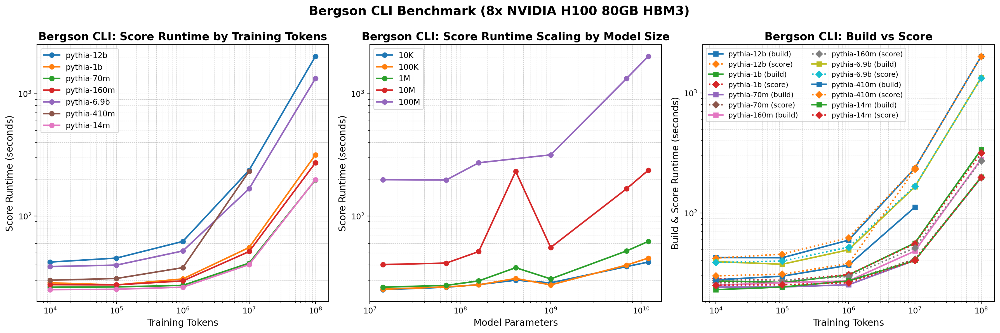
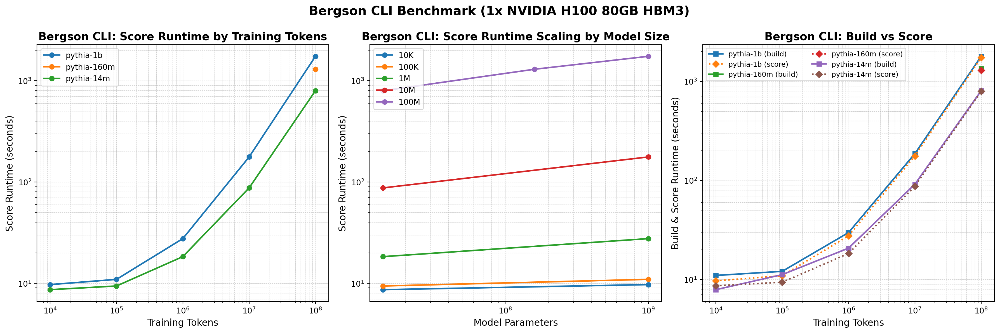
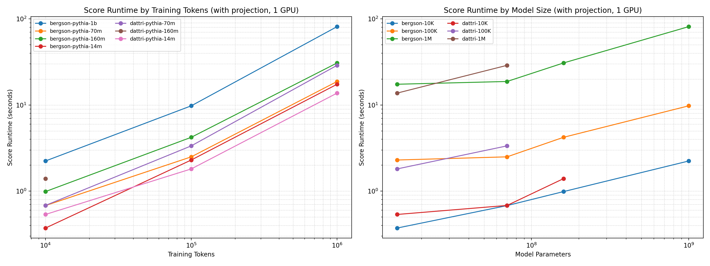
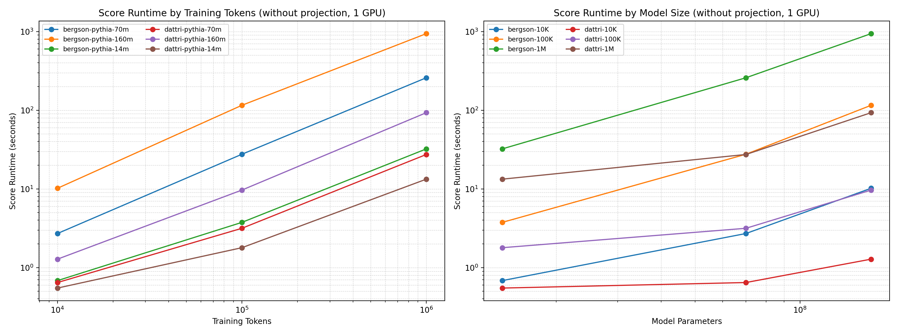
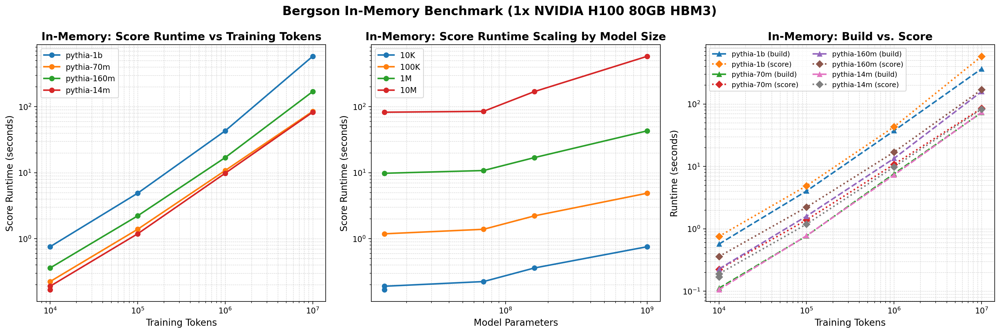

Benchmarks
==========

This section provides indicative performance numbers for the Bergson benchmark suite. Performance will vary based on your hardware configuration and choice of hyperparameters. Indicative performance for dattri provided where possible.

8 GPU Configuration (CLI)
~~~~~~~~~~~~~~~~~~~~~~~~~

1 GPU Configuration (CLI)
~~~~~~~~~~~~~~~~~~~~~~~~~

1 GPU Configuration (Random Projection)
~~~~~~~~~~~~~~~~~~~

1 GPU Configuration (No Random Projection)
~~~~~~~~~~~~~~~~~~~

1 GPU In-Memory Benchmark
~~~~~~~~~~~~~~~~~~~~~~~~~

Running Your Own Benchmarks
----------------------------

To generate benchmarks for your specific setup, you can use the shell scripts in `benchmarks`.
